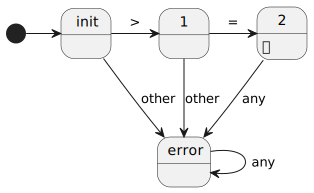

# Compiler

## Lexer

Der Lexer nimmt eine Zeichenkette als Eingabe entgegen und generiert daraus eine Liste von Tokens.

| Token-Name | Beschreibung                      | Beispiele             |
| ---------- | --------------------------------- | --------------------- |
|            |                                   |                       |
| Comment    |                                   | `/* abc */`, `// 123` |
| Whitespace | Leerzeichen, Tabs, Zeilenumbrüche |                       |

Regular grammar

In this project, there are three types of tokens:

-   Static tokens (`+`, `-`, `(`, `>=`, `&&`, ...)
-   Static identifier-like tokens (`if`, `while`, `function`, ...)
-   Dynamic tokens (Strings, whitespace, identifiers, ...)

## Parser

### Priorität

| Priorität | Operator | Beschreibung   |
| --------- | -------- | -------------- |
| 2         | `*`      | Multiplikation |
| 2         | `/`      | Division       |
| 1         | `+`      | Addition       |
| 1         | `-`      | Subtraktion    |

## Interpreter
